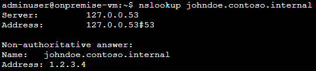
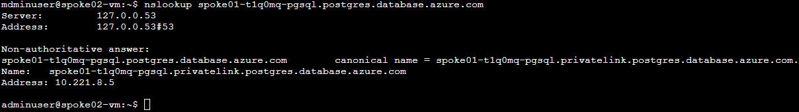
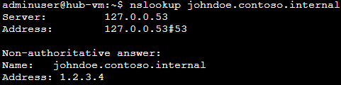
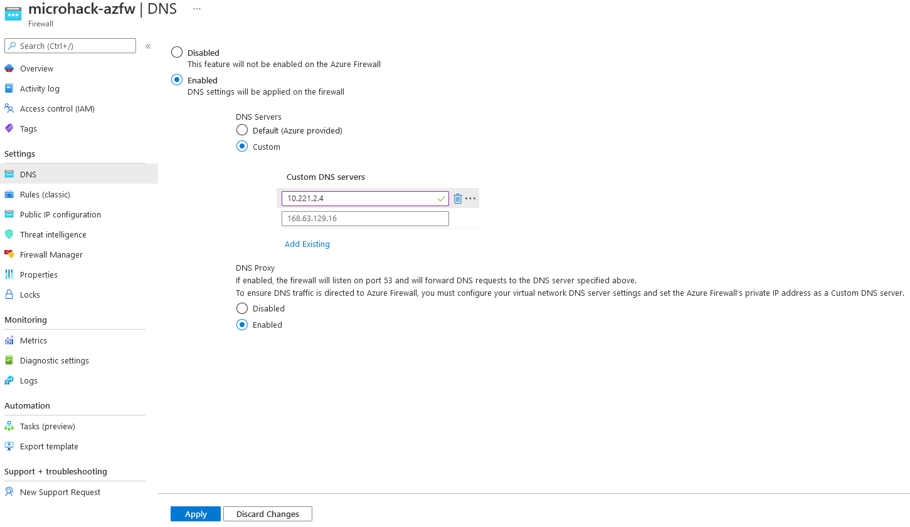
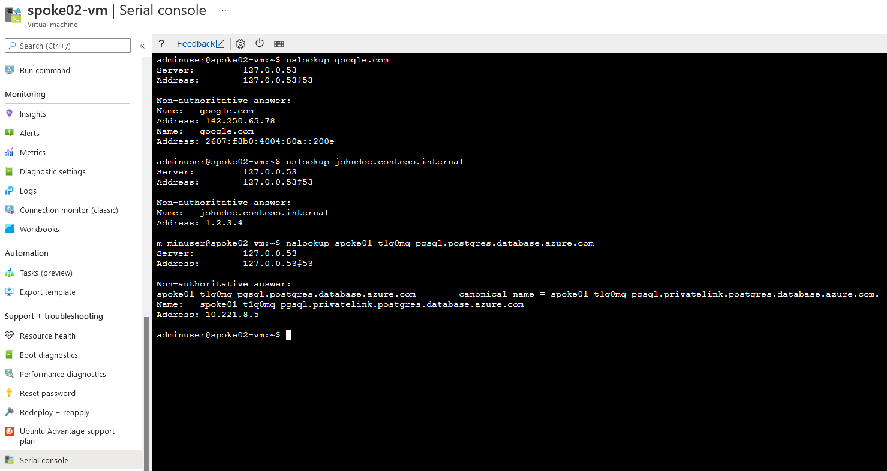
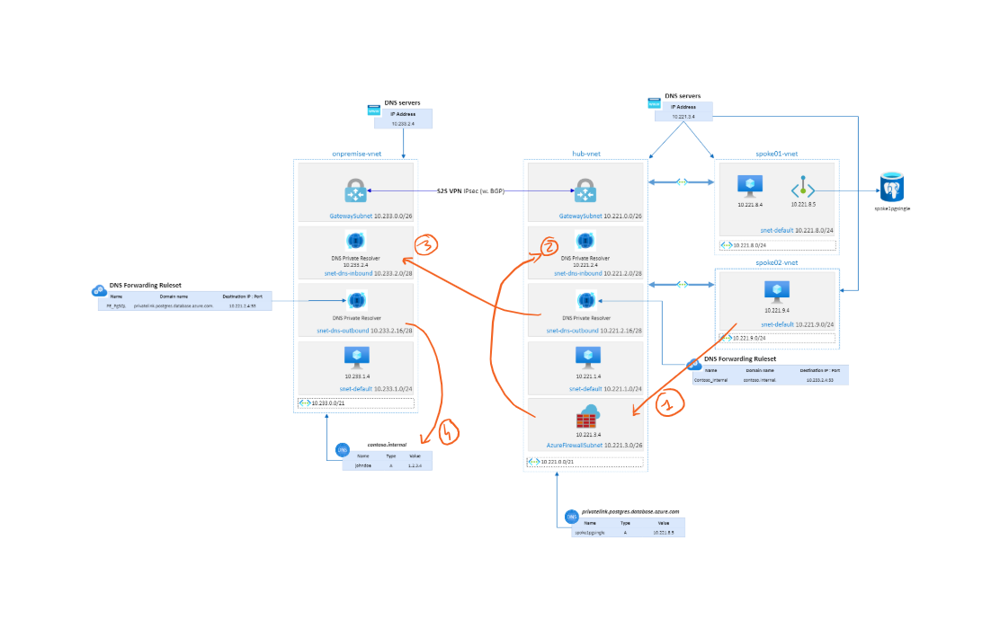
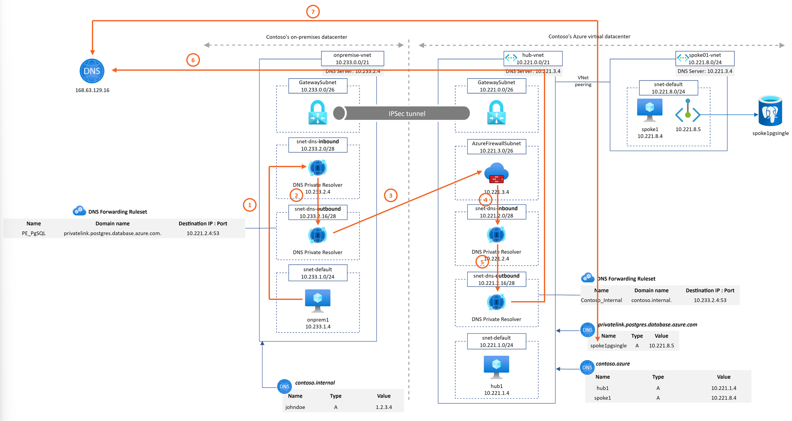

# Azure DNS Private Resolver - MicroHack

# Scenario
Contoso Inc.,....Lorem ipsum dolor sit amet, consectetur adipiscing elit, sed do eiusmod tempor incididunt ut labore et dolore magna aliqua. Ut enim ad minim veniam, quis nostrud exercitation ullamco laboris nisi ut aliquip ex ea commodo consequat. Duis aute irure dolor in reprehenderit in voluptate velit esse cillum dolore eu fugiat nulla pariatur. Excepteur sint occaecat cupidatat non proident, sunt in culpa qui officia deserunt mollit anim id est laborum.

Lorem ipsum dolor sit amet, consectetur adipiscing elit, sed do eiusmod tempor incididunt ut labore et dolore magna aliqua. Ut enim ad minim veniam, quis nostrud exercitation ullamco laboris nisi ut aliquip ex ea commodo consequat. Duis aute irure dolor in reprehenderit in voluptate velit esse cillum dolore eu fugiat nulla pariatur. Excepteur sint occaecat cupidatat non proident, sunt in culpa qui officia deserunt mollit anim id est laborum.

# Prerequisites

## Overview

In order to use the MicroHack time most effectively, the following tasks should be completed prior to starting the session.
At the end of this section your base lab build looks as follows:

In summary:
- Contoso's on-premise datacenter is simulated by an Azure Virtual Network ("onpremise-vnet"). It contains a Virtual Network Gateway to establish a site-2-site VPN connection to Contoso's Azure network.
- Azure DNS Private Resolver is instanciated on "onpremise-vnet". It is configured to forward to Azure hub DNS inbound IP address the "privatelink.postgres.database.azure.com" domain. It enable PaaS with Private Endpoint DNS resolution capabilities from "onpremise-vnet".
- Azure Private DNS Zone "contoso.internal" is linked to onpremise-vnet. It emulates a corporate domain.
- Contoso's Azure virtual datacenter is a hub&spoke network. The hub VNet ("hub-vnet") contains a Virtual Network Gateway that terminates the site-2-site VPN connection to Contoso's on-prem datacenter. 
- Azure DNS Private Resolver is instanciated on "hub-vnet". It is configured to forward to On-premise DNS infrastructure the "contoso.internal" domain. It enables "*.contoso.internal" DNS resolution capability from Azure hub and spokes networks. 
- The spoke01 VNet ("spoke01-vnet") contains the private endpoint associated to a PostgreSQL database located in spoke01-rg.
- All virtual networks contains a Linux Virtual Machine to perform nslookup checks.

## Task 1: Deploy Templates 

We are going to use a predefined Terraform template to deploy the base environment. It will be deployed in to *your* Azure subscription, with resources running in the specified Azure region.

To start the Terraform deployment, follow the steps listed below:

- Login to Azure cloud shell [https://shell.azure.com/](https://shell.azure.com/)
- Ensure that you are operating within the correct subscription via:

`az account show`

- Clone the following GitHub repository 

`git clone https://github.com/dawlysd/draft-azure-dns-private-resolver-microhack`

- Go to the new folder "draft-azure-dns-private-resolver-microhack/templates" and initialize the terraform modules and download the azurerm resource provider

`cd draft-azure-dns-private-resolver-microhack/templates`

`terraform init`

- Now run apply to start the deployment 

`terraform apply`

- Choose a suitable password to be used for your Virtual Machines administrator account (username: adminuser)

- When prompted, confirm with a **yes** to start the deployment

- Wait for the deployment to complete. This will take around 30 minutes (the VPN gateway takes a while).

## Task 2: Deploy Azure DNS Private Resolver

Azure DNS Private Resolver cannot be deploy using Terraform currently as the service is in Private Preview. To deploy this service, we will use a Powershell script:

- Go to the  folder "draft-azure-dns-private-resolver-microhack/scripts" and execute `privatednsresolvers.ps1` script:

`cd draft-azure-dns-private-resolver-microhack/scripts`

`./privatednsresolvers.ps1`

- When prompted, specify the Azure Subscription Id.

## Task 3: Explore and verify the deployed resources

- Verify you can access via Serial Console:
  - onpremise-vm in onpremise-rg 
  - hub-vm in hub-vnet in hub-rg 
  - spoke01-vm in spoke01-rg 
  - spoke02-vm in spoke02-rg

- Verify you can see hubdnsresolver and hubdnsruleset in hub-rg (**check** the *Show hidden types* checkbox)
- Verify you can see onpremisednsresolver and onpremisednsruleset in onpremise-rg (**check** the *Show hidden types* checkbox)
- Verify the S2S VPN connections are connected

## :checkered_flag: Results

- You have deployed a basic Azure and On-Premises environment using a Terraform template
- You have become familiar with the components you have deployed in your subscription
- You are now able to login to all VMs using your specified credentials via Serial Console
- End-to-end network connectivity has been verified from On-Premise to Azure

# Challenge 1: Configure DNS Forwarding Ruleset

During the infrastructure deployment with Terraform and the Powershell script, no forwarder rules were configured.

It means that:

1.  *\*.contoso.internal* DNS resolution is working from on-premise network:
  

**Nevertheless, *"\*.contoso.internal"* DNS resolution is not possible from hub & spokes networks** currently.

2. Privatelink DNS resolution is working from Azure hub & spokes networks:
- *spoke01-t1q0mq-pgsql.postgres.database.azure.com* DNS resolution from hub-vm
  

- *spoke01-t1q0mq-pgsql.postgres.database.azure.com* DNS resolution from spoke01-vm
  

- *spoke01-t1q0mq-pgsql.postgres.database.azure.com* DNS resolution from spoke02-vm

**Nevertheless, *"\*.postgres.database.azure.com"* DNS resolution is not possible from on-premise network** currently.

Let's configure DNS Forwarding Ruleset for both Hub and Onpremise to unlock these capabilities.

## Task 1: Configure Hub DNS Forwarding Ruleset for *contoso.internal* domain

1. In hub-rg, check "Show hidden types" and open Dns Forwarding Ruleset

2. Add Forwarding Rule for *contoso.internal.* domain to On-premise DNS inbound IP address: `10.233.2.4:53`

3. Check that now, hub & spokes networks are able to resolve *johndoe.contoso.internal* domain
  
* From hub-vm: 

* From spoke01-vm
  

* From spoke02-vm
  

## Task 2: Configure Onpremise DNS Forwarding Ruleset for postgresql domain

1. In onpremise-rg, check "Show hidden types" and open Dns Forwarding Ruleset

2. Add Forwarding Rule for *privatelink.postgres.database.azure.com.* domain to Azure DNS inbound IP address: `10.221.2.4:53`

  > If you plan to go add other PaaS Services during this MicroHack and want to enable DNS resolution from on-premise, it will be required too add additional Private DNS zone name. Full list is available [here](https://docs.microsoft.com/en-us/azure/private-link/private-endpoint-dns).

3. Check *spoke01-t1q0mq-pgsql.postgres.database.azure.com* DNS resolution from onpremise-vm

## :checkered_flag: Results

- *\*.contoso.internal* DNS resolution from Azure hub&spokes networks is now possible (in addition of on-premise network):

- Privatelink DNS resolution from on-premise network is now possible (in addition of azure hub&spokes networks):

# Challenge 2: Deploy Azure Firewall to get DNS logs

Azure DNS Private Resolve does not offer today to view the logs of DNS requests made.

A solution to have these logs is to deploy Azure Firewall and use it as a DNS proxy:
* Hub & Spokes vnets will have their DNS Servers configured with Private IP address of Azure Firewall
* Azure Firewall will be configure as DNS Proxy: it will forward all DNS requests to Azure DNS Private Resolver inbound IP address

## Task 1: Deploy Azure Firewall

In the Azure Portal, deploy a new Azure Firewall instance in the hub-vnet. A subnet named "AzureFirewallSubnet" has been already created for you.

Your Azure Firewall instance will take about 10 minutes to deploy. When the deployment completes, go to the new firewall's overview tile a take note of its *private* IP address. 

## Task 2: Configure Azure Firewall DNS proxy

Configure Azure Firewall as a DNS Proxy: all requests will be forward to DNS Private Resolver Inbound IP address `10.221.2.4`:

## Task 3: Update Hub and spokes Vnet DNS Settings

Instead of configuring DNS Private Resolver Inbound IP address as DNS Server for hub-vnet, spoke01-vnet and spoke02-vnet, configure with Azure Firewall private IP address:

**Do the same for spoke01-vnet and spoke02-vnet**.

**Restart** hub-vm, spoke01-vm and spoke02-vm.

  > DNS server(s) used by Azure virtual machine (VM) come during VM boot via DHCP. By restarting VMs here, they will pick the new DNS server to use.

## Task 4: Update Onpremise DNS Forwarding Ruleset for postgresql domain

Instead of pointing to DNS Private Resolver Inbound IP address for *\*.postgres.database.azure.com* domain, requests will be forward to Azure Firewall private IP address in the hub:

## Task 5: Create a Log Analaytics Workspace and configure Azure Firewall Logs

In hub-rg, create a "networkmonitoring" Log Analytics Workspace:

Configure Azure Firewall Diagnostic Settings to send its logs to *networkmonitoring* Log Analytics Workspace:

 
  > It can take 10-20 minutes for the logs to appear in the Log Analytics Workspace. Take a ☕!

## Task 6: Generate DNS request from Azure Hub&spokes VM and display logs

Generate DNS requests from spoke02-vm:

Display Azure Firewall DNS logs:

## :checkered_flag: Results

- *\*.contoso.internal* DNS resolution from Azure hub&spokes networks is still possible (in addition of on-premise network) but goes through Azure Firewall first:

- Privatelink DNS resolution from on-premise network is still possible (in addition of azure hub&spokes networks) but goes through Azure Firewall:

# Challenge 3: Configure continuous public and private DNS resolution capabilities from Onpremise and Azure VMs

FAQs

What is an Inbound Endpoint?

-  An inbound endpoint will enable name resolution from on-prem or other private location via an IP address which is part of your private Virtual Network address space. This endpoint will require a subnet in the VNet where it’s provisioned, without any other service running in it and can only be delegated to Microsoft.Network/dnsResolvers. Your DNS queries will ingress to Azure.
- You will be able to resolve these names in scenarios where you have Private DNS Zones, including VMs which are using auto registration, or Private Link enabled services.

What is an Outbound Endpoint?

- An outbound endpoint will enable conditional forwarding name resolution from Azure to on-prem, other cloud providers or external DNS servers. This endpoint will require a subnet in the VNet where it’s provisioned, without any other service running in it and can only be delegated to Microsoft.Network/dnsResolvers. Your DNS queries will egress from Azure.

What is a Virtual Network Link?

- Virtual Network links enable name resolution for Virtual Networks which are linked to an outbound endpoint with a DNS Forwarding Ruleset. This is a 1:1 relationship.

What is a DNS Forwarding Ruleset?

- DNS Forwarding Ruleset is a group of DNS Forwarding Rules (up to 1,000) which can be applied to one or more Outbound Endpoints, or linked to one or more Virtual Networks. This is a 1:N relationship.

What is a DNS Forwarding Rule?

- DNS Forwarding Rule includes one or more target DNS servers which will be used for conditional forwarding and is represented by a domain name, target IP address, target Port and Protocol (UDP or TCP).

Virtual network restrictions: The following restrictions hold with respect to virtual networks:
- DNS resolver can reference a virtual network in the same region as the DNS resolver only.
- Virtual network CANNOT be shared between multiple DNS resolvers; i.e., a single virtual network can be referenced by a single DNS resolver only.

Subnet restrictions: Subnets used for DNS resolver have the following limitations:
- Subnet must have a minimum of /28 address space or a maximum of /24 address space.
- Subnet CANNOT be shared between multiple DNS resolver endpoints; i.e., a single subnet can be used by a single DNS resolver endpoint only.
- All IP configurations for a DNS resolver inbound endpoint MUST reference the same subnet; i.e., spanning multiple subnets in IP configurations of a single DNS resolver inbound endpoint is not allowed.
- Subnet used for IP configuration for DNS resolver inbound endpoints must be within the virtual network referenced by the parent DNS resolver.

Outbound endpoint restrictions: Outbound endpoints have the following limitations:
- Outbound endpoint cannot be deleted unless the DNS forwarding ruleset and the virtual network links under it are deleted

DNS forwarding ruleset restrictions: DNS forwarding ruleset have the following limitations:
- DNS forwarding ruleset cannot be deleted unless the virtual network links under it are deleted

# Finished? Delete your lab

- Delete the resource group onpremise-rg
- Delete the resource group hub-rg
- Delete the resource group spoke01-rg
- Delete the resource group spoke02-rg

Thank you for participating in this MicroHack!
