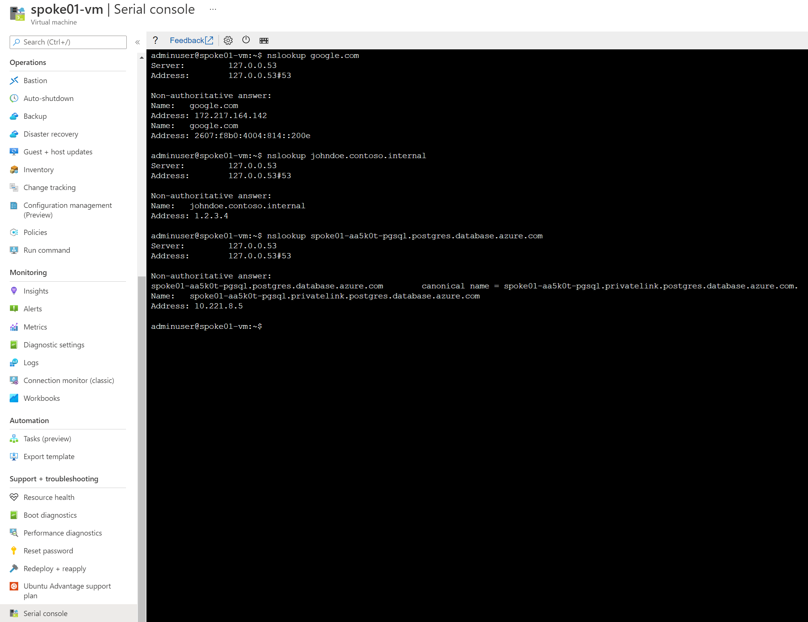

# Azure DNS Private Resolver - MicroHack

### [Prerequistes](#prerequisites)

### [Challenge 1: Configure DNS Forwarding Ruleset](#challenge-1-configure-dns-forwarding-ruleset-1)

### [Challenge 2: Deploy Azure Firewall to get DNS logs](#challenge-2-deploy-azure-firewall-to-get-dns-logs-1)

# Prerequisites

## Overview

This Microhack purpose is to demonstrate the Azure DNS Private resolver feature. A common architecture found around DNS setup between on-premise and Azure environments looks like


For this workshop, we'll emulate the on-premise part with an on-premise Vnet and Azure DNS Private resolver also as shown on the following diagram


In order to use the MicroHack time most effectively, the following tasks should be completed prior to starting the session.

In summary:
- Contoso's on-premise datacenter is simulated by an Azure Virtual Network ("onpremise-vnet"). It contains a Virtual Network Gateway to establish a site-2-site VPN connection to Contoso's Azure network.
- Azure DNS Private Resolver is instanciated on "onpremise-vnet". It is configured to forward to Azure hub DNS inbound IP address the "privatelink.postgres.database.azure.com" domain. It enable PaaS with Private Endpoint DNS resolution capabilities from "onpremise-vnet".
- Azure Private DNS Zone "contoso.internal" is linked to onpremise-vnet. It emulates a corporate domain.
- Contoso's Azure virtual datacenter is a hub&spoke network. The hub VNet ("hub-vnet") contains a Virtual Network Gateway that terminates the site-2-site VPN connection to Contoso's on-prem datacenter. 
- Azure Private DNS Zone "contoso.azure" is linked to hub-vnet.
- Azure DNS Private Resolver is instanciated on "hub-vnet". It is configured to forward to On-premise DNS infrastructure the "contoso.internal" domain. It enables "*.contoso.internal" DNS resolution capability from Azure hub and spokes networks. 
- The spoke01 VNet ("spoke01-vnet") contains the private endpoint associated to a PostgreSQL database located in spoke01-rg.
- All virtual networks contains a Linux Virtual Machine to perform nslookup checks.

## Task 1: Request Azure DNS Private Resolver private preview access

Azure DNS Private Resolver is currently in Private Preview, you must not deploy it in production or on business critical environment.

To provision Azure DNS Private Resolver, it is required to activate the preview on your subscription. 

**Reach out [azuredns-privaterr@microsoft.com](azuredns-privaterr@microsoft.com) to request service activation on your subscription.**

## Task 2: Deploy Templates 

We are going to use a predefined Terraform template to deploy the base environment. It will be deployed in to *your* Azure subscription, with resources running in the specified Azure region.

To start the Terraform deployment, follow the steps listed below:

- Login to Azure cloud shell (Powershell is a requirement for future steps) [https://shell.azure.com/](https://shell.azure.com/)
- Ensure that you are operating within the correct subscription via:

`az account show`

- Clone the following GitHub repository 

`git clone https://github.com/dawlysd/draft-azure-dns-private-resolver-microhack`

- Go to the new folder "draft-azure-dns-private-resolver-microhack/templates" and initialize the terraform modules and download the azurerm resource provider

`cd draft-azure-dns-private-resolver-microhack/templates`

`terraform init`

- Now run apply to start the deployment 

`terraform apply`

- Choose a suitable password to be used for your Virtual Machines administrator account (username: adminuser)

- When prompted, confirm with a **yes** to start the deployment

- Wait for the deployment to complete. This will take around 30 minutes (the VPN gateway takes a while).

## Task 3: Deploy Azure DNS Private Resolver

Azure DNS Private Resolver cannot be deploy using Terraform currently as the service is in Private Preview. To deploy this service, we will use a Powershell script:

- Go to the  folder "draft-azure-dns-private-resolver-microhack/scripts" and execute `privatednsresolvers.ps1` script:

`cd draft-azure-dns-private-resolver-microhack/scripts`

`./privatednsresolvers.ps1`

- When prompted, specify the Azure Subscription Id.

## Task 4: Explore and verify the deployed resources

- Verify you can access via Serial Console:
  - onpremise-vm in onpremise-rg 
  - hub-vm in hub-vnet in hub-rg 
  - spoke01-vm in spoke01-rg

- Verify you can see hubdnsresolver and hubdnsruleset in hub-rg (**check** the *Show hidden types* checkbox)
- Verify you can see onpremisednsresolver and onpremisednsruleset in onpremise-rg (**check** the *Show hidden types* checkbox)
- Verify the S2S VPN connections are connected

## :checkered_flag: Results

- You have deployed a basic Azure and On-Premises environment using a Terraform template
- You have become familiar with the components you have deployed in your subscription
- You are now able to login to all VMs using your specified credentials via Serial Console
- End-to-end network connectivity has been verified from On-Premise to Azure

# Challenge 1: Configure DNS Forwarding Ruleset

During the infrastructure deployment with Terraform and the Powershell script, no forwarder rules were configured.

It means that:

1.  *\*.contoso.internal* DNS resolution is working from on-premise network:
  


**Nevertheless, *"\*.contoso.internal"* DNS resolution is not possible from hub & spokes networks** currently.

2. Privatelink DNS resolution is working from Azure hub & spokes networks:
- *spoke01-t1q0mq-pgsql.postgres.database.azure.com* DNS resolution from hub-vm
  


- *spoke01-t1q0mq-pgsql.postgres.database.azure.com* DNS resolution from spoke01-vm
  


**Nevertheless, *"\*.postgres.database.azure.com"* private DNS resolution is not possible from on-premise network currently and the public IP address associated with the database would be returned.**


Let's configure DNS Forwarding Ruleset for both Hub and Onpremise to unlock these capabilities.

## Task 1: Configure Hub DNS Forwarding Ruleset for *contoso.internal* domain

1. In hub-rg, check "Show hidden types" and open Dns Forwarding Ruleset


2. Add Forwarding Rule for *contoso.internal.* domain to On-premise DNS inbound IP address: `10.233.2.4:53`


3. Check that now, hub & spokes networks are able to resolve *johndoe.contoso.internal* domain
  
* From hub-vm: 


* From spoke01-vm
  


## Task 2: Configure Onpremise DNS Forwarding Ruleset for postgresql domain

1. In onpremise-rg, check "Show hidden types" and open Dns Forwarding Ruleset


2. Add Forwarding Rule for *privatelink.postgres.database.azure.com.* domain to Azure DNS inbound IP address: `10.221.2.4:53`


  > If you plan to go add other PaaS Services during this MicroHack and want to enable DNS resolution from on-premise, it will be required to add additional Private DNS zone name. Full list is available [here](https://docs.microsoft.com/en-us/azure/private-link/private-endpoint-dns).

3. Check *spoke01-t1q0mq-pgsql.postgres.database.azure.com* DNS resolution from onpremise-vm


## :checkered_flag: Results

- *\*.contoso.internal* DNS resolution from Azure hub&spokes networks is now possible (in addition of on-premise network):


- Privatelink DNS resolution from on-premise network is now possible (in addition of azure hub&spokes networks):


# Challenge 2: Deploy Azure Firewall to get DNS logs

Azure DNS Private Resolver does not offer today capabilities to view the logs of DNS requests made.

A solution to have these logs is to deploy Azure Firewall and use it as a DNS proxy:
* Hub & Spokes vnets will have their DNS Servers configured with Private IP address of Azure Firewall
* Azure Firewall will be configure as DNS Proxy: it will forward all DNS requests to Azure DNS Private Resolver inbound IP address


## Task 1: Deploy Azure Firewall

In the Azure Portal, deploy a new Azure Firewall instance in the hub-vnet. A subnet named "AzureFirewallSubnet" has been already created for you.


Your Azure Firewall instance will take about 10 minutes to deploy. When the deployment completes, go to the new firewall's overview tile and take note of its *private* IP address. 

## Task 2: Configure Azure Firewall DNS proxy

Configure Azure Firewall as a DNS Proxy: all requests will be forward to DNS Private Resolver Inbound IP address `10.221.2.4`:


## Task 3: Update Hub and spokes Vnet DNS Settings

Instead of configuring DNS Private Resolver Inbound IP address as DNS Server for hub-vnet and spoke01-vnet, configure with Azure Firewall private IP address:


**Do the same for spoke01-vnet**.

**Restart** hub-vm and spoke01-vm.

  > DNS server(s) used by Azure virtual machine (VM) come during VM boot via DHCP. By restarting VMs here, they will pick the new DNS server to use.

## Task 4: Update Onpremise DNS Forwarding Ruleset for postgresql domain

Instead of pointing to DNS Private Resolver Inbound IP address for *\*.postgres.database.azure.com* domain, requests will be forward to Azure Firewall private IP address in the hub:


## Task 5: Create a Log Analaytics Workspace and configure Azure Firewall Logs

In hub-rg, create a "networkmonitoring" Log Analytics Workspace:


Configure Azure Firewall Diagnostic Settings to send its logs to *networkmonitoring* Log Analytics Workspace:


 
  > It can take 10-20 minutes for the logs to appear in the Log Analytics Workspace. Take a ☕!

## Task 6: Generate DNS request from Azure Hub&spokes VM and display logs

Generate DNS requests from spoke01-vm:



Display Azure Firewall DNS logs using the following query
```
// Azure Firewall DNS proxy log data 
// Start from this query if you want to understand the Firewall DNS proxy log data. This query will show the last 100 log records but by adding simple filter statements at the end of the query the results can be tweaked. 
// DNS proxy log data 
// Parses the DNS proxy log data. 
AzureDiagnostics
| where Category == "AzureFirewallDnsProxy"
| parse msg_s with "DNS Request: " SourceIP ":" SourcePortInt:int " - " QueryID:int " " RequestType " " RequestClass " " hostname ". " protocol " " details
| extend
    ResponseDuration = extract("[0-9]*.?[0-9]+s$", 0, msg_s),
    SourcePort = tostring(SourcePortInt),
    QueryID =  tostring(QueryID)
| project TimeGenerated,SourceIP,hostname,RequestType,ResponseDuration,details,msg_s
| order by TimeGenerated
| limit 100
```

You can then observe the associated DNS queries in you Azure infrastructure passing through the Azure Firewall


## :checkered_flag: Results

- *\*.contoso.internal* DNS resolution from Azure hub&spokes networks is still possible (in addition of on-premise network) but goes through Azure Firewall first:


- Privatelink DNS resolution from on-premise network is still possible (in addition of azure hub&spokes networks) but goes through Azure Firewall:


# Finished? Delete your lab

- Delete the resource group onpremise-rg
- Delete the resource group hub-rg
- Delete the resource group spoke01-rg

Thank you for participating in this MicroHack!


# Credits

This lab is inspired by the [internet-outbound-microhack](https://github.com/fguerri/internet-outbound-microhack) of [Federic Guerrini](https://github.com/fguerri).
